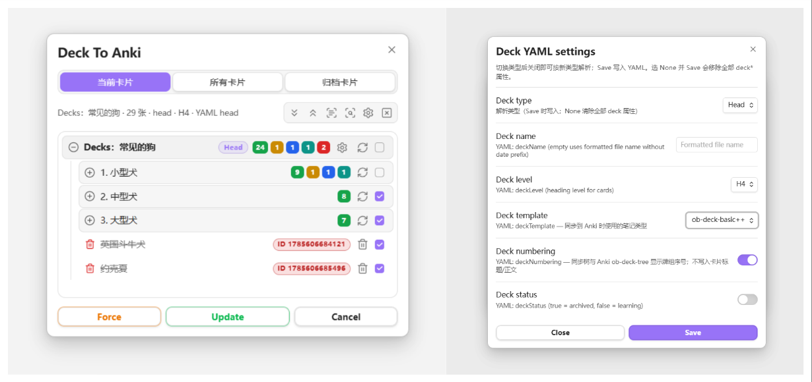
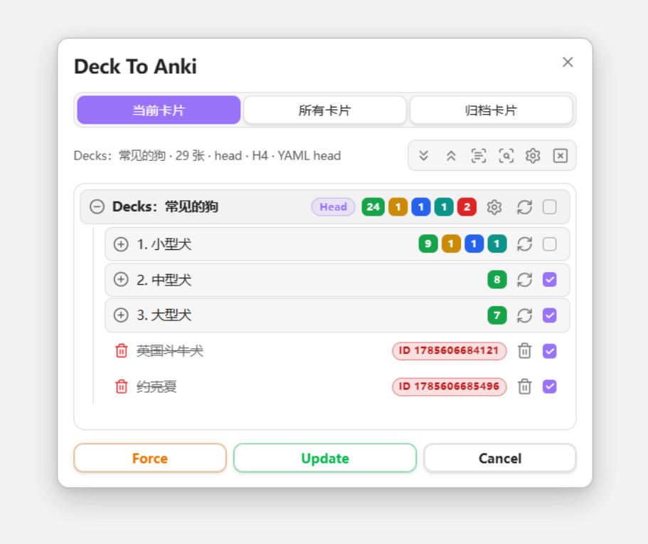
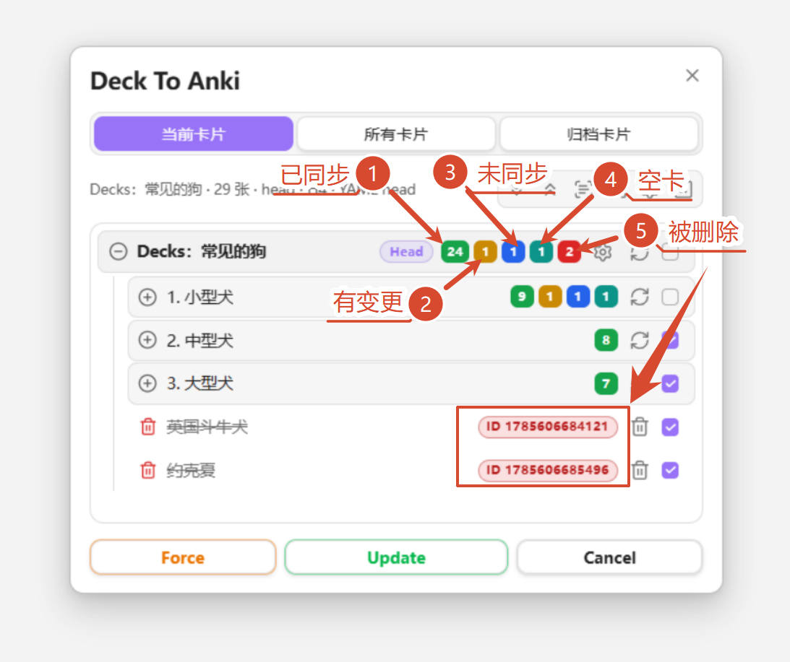
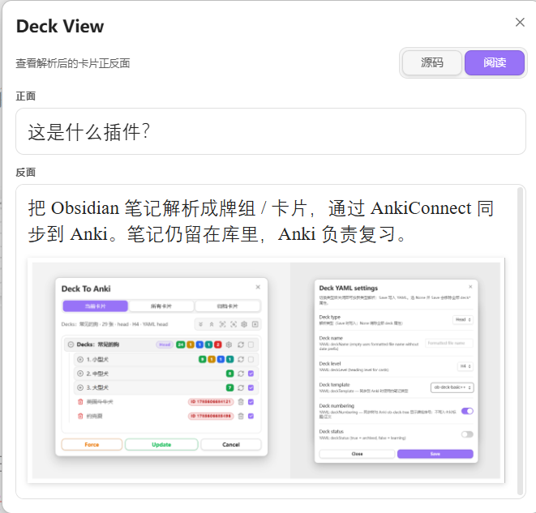
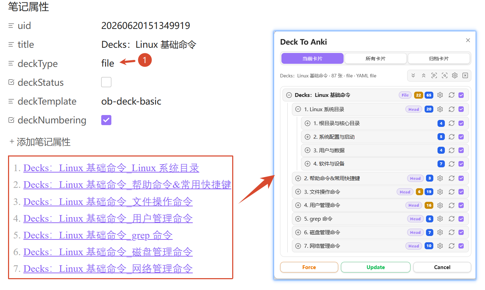
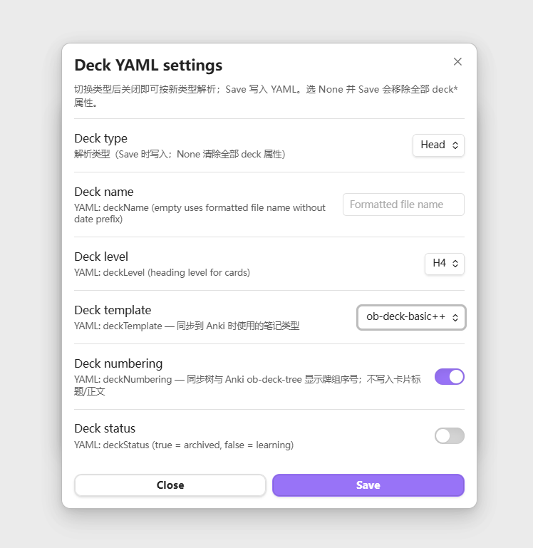
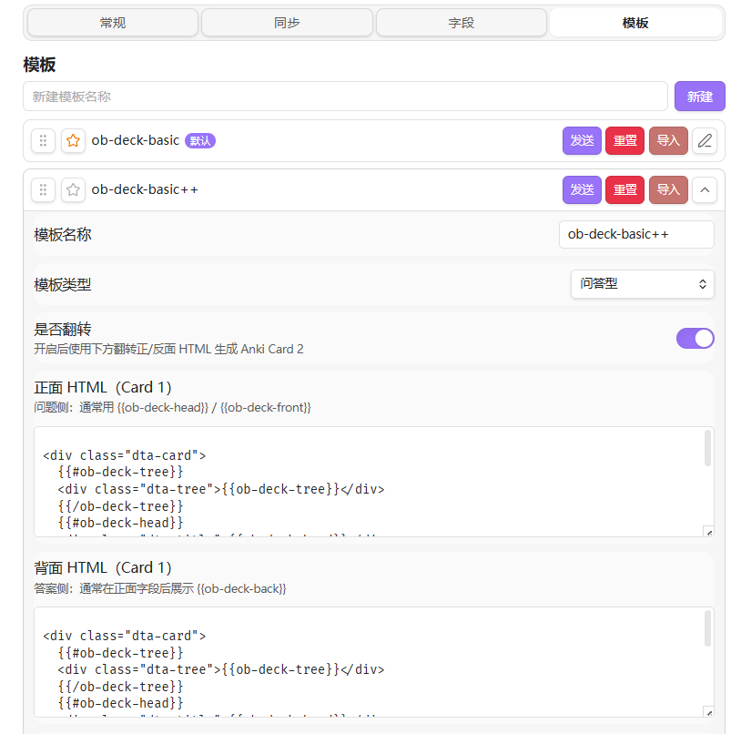
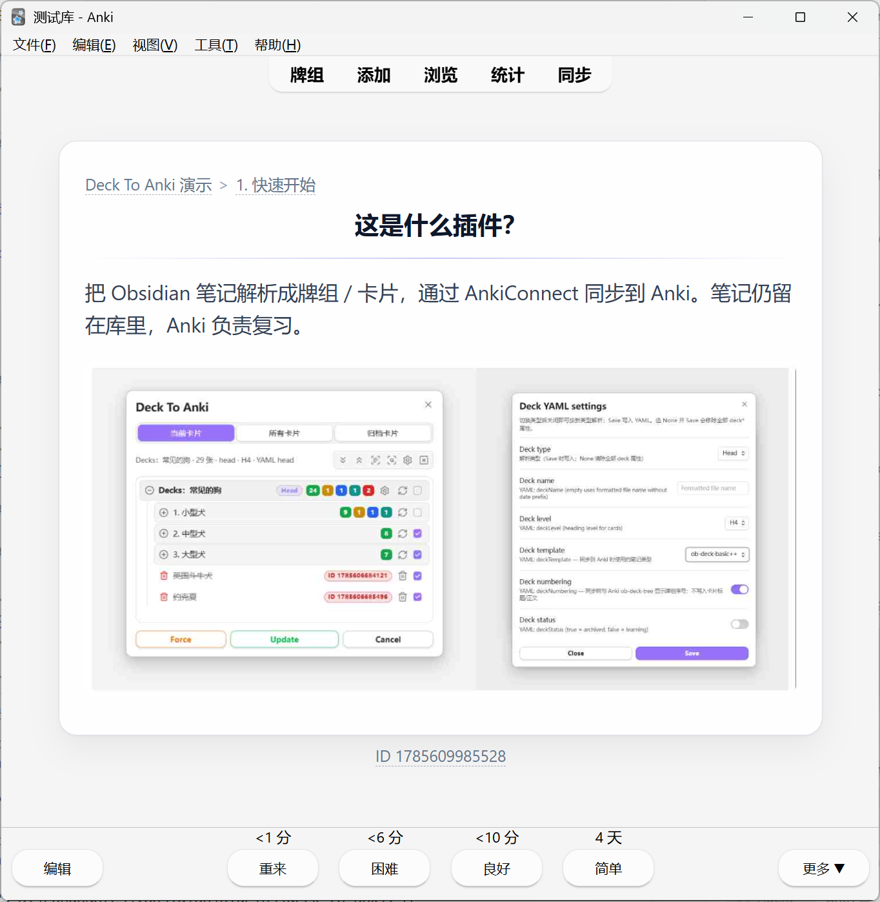
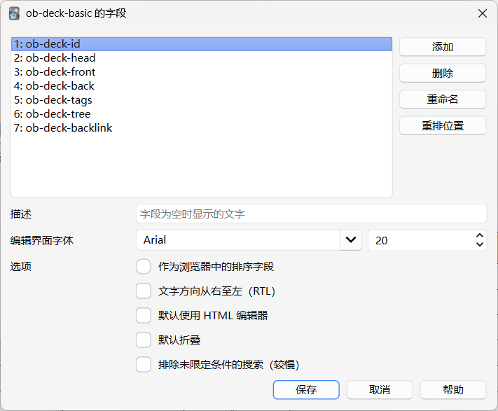

# Deck To Anki

## 插件简介

Deck To Anki 是 Obsidian 中用来快速制作成Anki牌组的插件，通过 [AnkiConnect](https://foosoft.net/projects/anki-connect/) 将笔记推送到 Anki。可以单向同步、更新、修改卡片，以及反向定位到 Obsidian 卡片所在的笔记、标题、块。

适合在 Obsidian 中整理知识、在 Anki 中打卡记忆的工作流：用标题树、列表或整篇笔记自然写卡，在同步面板预览与勾选后一键推送；支持状态检测、回链跳回原文，以及图片、公式等富内容。



### 功能一览

- **笔记即卡片**：在 Obsidian 中直接写笔记即可生成问答卡，无需额外制卡工具
- **四种解析模式**：`head` / `list` / `card` / `file`，适配标题树、列表、单卡与按章节拆分
- **可翻转模板**：内置 `ob-deck-basic++`，支持正反面互换复习
- **富内容同步**：图片、公式、表格、代码块、标签均可进入 Anki
- **Wiki 链接与嵌入**：支持 `[[笔记]]`、`![[图片]]` 等链接解析
- **回链原文**：可将回链写入 Anki 字段，配合 ObURI / Advanced URI 一键跳回 Obsidian
- **图片压缩**：同步时压缩图片（不改库内源文件），结果自动缓存，减小牌组体积

## 快速开始

### 准备工作

### 准备工作

1. 安装并启用 **Deck To Anki** 插件
2. 安装并启动 [Anki](https://apps.ankiweb.net/) + [AnkiConnect](https://foosoft.net/projects/anki-connect/)（默认 `http://127.0.0.1:8765`）

AnkiConnect 配置：

```json
{
    "apiKey": null,
    "apiLogPath": null,
    "ignoreOriginList": [],
    "webBindAddress": "127.0.0.1",
    "webBindPort": 8765,
    "webCorsOriginList": [
        "http://localhost",
        "app://obsidian.md"
    ]
}
```

### 打开同步面板

- 功能区点击 Anki 图标，或
- 命令面板执行 **Deck To Anki**

面板中可预览解析结果、勾选卡片、检测与 Anki 的差异，再执行 **Update** / **Force** 同步。可先复制仓库内 [`examples/Deck-To-Anki-演示.md`](examples/Deck-To-Anki-演示.md) 到库中试跑一遍。

## 详细介绍

### 同步面板

点击侧边栏Anki按钮或`Deck To Anki`命令可以打开同步面板。



- **当前卡片**：解析活动笔记
- **所有卡片 / 归档卡片**：按扫描范围扫描库中带 `deckType` 的笔记
- 工具栏：展开/折叠、全选、检测、刷新、Force、Update
- 行操作：预览解析、牌组 YAML 设置、单卡同步、勾选

检测相关选项在 **设置 → 同步 → 检测**。

### 检测效果

每种检测状态用不同颜色区分：

| 状态    | 颜色    | 含义                         |
| ------- | ------- | ---------------------------- |
| 已同步  | 🟩 绿色 | 与 Anki 一致                 |
| 被修改  | 🟥 红色 | 本地相对 Anki 有变更         |
| 未同步  | 🟨 黄色 | 尚未推送到 Anki              |
| 仅 Anki | 🟦 蓝色 | Anki 有、本地无              |
| empty   | 🩵 青色 | 背面为空（解析后默认不勾选） |
| 未检测  | 🩶 灰色 | 尚未对比 Anki，未进行检测    |

面板检测效果如下图所示：



### 卡片预览

点击卡片条目上的 DeckView 按钮可以预览卡片效果：



### 解析模式

| 模式                   | 说明                                                                 | 笔记 ID 写入位置      |
| ---------------------- | -------------------------------------------------------------------- | --------------------- |
| **Head**（默认） | 指定层级标题为卡片正面，正文为反面；可用单独一行的`---` 再拆正反面 | `<!--ID: n-->`      |
| **List**         | 顶层列表项为正面，缩进内容为反面（反面会去掉一层缩进）               | 列表行末尾`^deckID` |
| **Card**         | 去掉 YAML 后，用单独一行的`---` 分隔正面与反面；整篇笔记一张卡     | YAML`deckID`        |
| **File**         | 父笔记通过 wiki 链接组织子笔记，子笔记可再按 head/list/card 解析     | 视子笔记模式而定      |

File 模式主要用于按章节拆分制卡：父笔记通过 wiki 链接组织子笔记，子笔记各自按 head / list / card 解析。注意：**不支持 File 模式嵌套**（子笔记不能再以 File 模式解析），如下图所示：



### Deck 属性

通过 Deck To Anki 制卡，会将每张卡牌的设置记录在笔记的 YAML 属性中，可直接在牌组条目的设置面板中直接设置：



| 字段              | 说明                                      |
| ----------------- | ----------------------------------------- |
| `deckType`      | `head` / `list` / `card` / `file` |
| `deckName`      | 牌组显示名（可选）                        |
| `deckLevel`     | Head：卡片标题层级（1–6）                |
| `deckStatus`    | `false` 学习中；`true` 归档           |
| `deckFile`      | File 模式：父笔记索引`父笔记`           |
| `deckTemplate`  | Anki 笔记模板 id                          |
| `deckNumbering` | 是否同步牌组编号到树字段                  |
| `deckID`        | Card 模式：Anki note id                   |

## 插件设置

设置一览

- **常规**：默认解析模式、标题层级、Wiki 链接、Deck View、扫描范围
- **同步**：AnkiConnect URL、牌组编号、检测选项、图片压缩
- **字段**：标签 / 回链 / 牌组树字段开关与回链协议
- **模板**：内置与自定义 Anki 卡片模板（Front / Back / CSS）

### 常规设置

**设置 → 常规** 主要项（单笔记 YAML 可覆盖）：

1. **默认牌组模式** — `head` / `list` / `card` / `file`（默认 Head）
2. **默认标题层级** — Head 模式无 `deckLevel` 时使用（默认 H4）
3. **解析 Wiki 链接** — 是否把 `[[链接]]` 转为可点击回链（不影响 `![[媒体]]`）
4. **Deck View 默认视图** — 源码 / 阅读

**扫描范围**（仅影响「所有 / 归档」）：

1. **扫描文件夹** — 空 = 整个库；可多选，含子文件夹
2. **忽略文件夹** — 从结果中排除
3. **标签限制** — 只保留带指定标签的笔记；`anki` 可匹配 `anki/deck`

### 同步设置

需安装 [Anki](https://apps.ankiweb.net/) + [AnkiConnect](https://foosoft.net/projects/anki-connect/)（默认 `http://127.0.0.1:8765`）。

**设置 → 同步** 主要项：

1. **AnkiConnect URL** — 服务地址
2. **同步检测** — 打开面板 / 勾选时是否自动对照 Anki，以及同步前是否必须先检测
3. **图片压缩** — 仅压缩上传到 Anki 的图片，不改库内源文件；可调质量、清空缓存

### 模板设置

默认有 ob-deck-basic 问答卡和 ob-deck-basic++ 可翻转问答卡，可以自定义正反面 HTML DOM 以及 CSS。



默认配置在 Anki 中的效果：



### 字段设置

**设置 → 字段** 控制写入 Anki 的可选字段：

1. **同步标签** — 写入 `ob-deck-tags`，并同步为 Anki 笔记标签
2. **卡片回链** — 写入 `ob-deck-backlink`（Head → 标题，List → 块，Card → 文件）
3. **牌组树** — 写入 `ob-deck-tree`；可开启各段可点击跳转
4. **回链协议** — `none` / `oburi` / `aduri`（Advanced URI）

对应 Anki 字段如下：




| 字段             | 说明                                            |
| ---------------- | ----------------------------------------------- |
| ob-deck-id       | 笔记身份字段（模型首字段，供 AnkiConnect 使用） |
| ob-deck-head     | 卡片标题（导航标题）；与正面正文分开存储。      |
| ob-deck-front    | 卡片正面正文（不含标题时仅正文）。              |
| ob-deck-back     | 卡片背面内容。                                  |
| ob-deck-tags     | Obsidian 标签展示；可同步为 Anki 笔记标签。     |
| ob-deck-tree     | 牌组路径面包屑（如一级》子牌组）。              |
| ob-deck-backlink | 回链到 Obsidian 当前卡片（标题 /块 /文件）。    |

## 可用命令

| 命令                                 | 作用                                      |
| ------------------------------------ | ----------------------------------------- |
| Deck To Anki                         | 打开同步弹窗                              |
| 打开同步侧边栏                       | 打开同步侧边栏视图                        |
| 清空当前文件所有 deckID              | 清空当前文件所有 deckID                   |
| 清空当前文件所有 deckID 和 deck YAML | 清空当前文件所有 deckID 和 deck YAML 属性 |

## 安装

### BRAT 安装

通过 [BRAT](https://github.com/TfTHacker/obsidian42-brat) 添加仓库：

```text
PandaNocturne/obsidian-deck-to-anki
```

### 手动安装

1. 打开 [Releases](https://github.com/PandaNocturne/obsidian-deck-to-anki/releases) 下载最新版
2. 将 `main.js`、`manifest.json`、`styles.css` 放到：

```text
<Vault>/.obsidian/plugins/deck-to-anki/
```

3. 重启 Obsidian，在 **设置 → 社区插件** 中启用 **Deck To Anki**

### 从源码构建

```bash
npm install
npm run build
```

根目录的 `main.js`、`manifest.json`、`styles.css`。

## 开发

```bash
npm install
npm run dev    # watch 编译
npm run build  # 生产构建
npm run lint
```

发布新版本时：

1. 更新 `manifest.json` 的 `version` / `minAppVersion`
2. `npm version <new>`（会更新 `versions.json`）
3. `npm run build`
4. `git push origin <tag>`
5. `gh release create <tag> main.js manifest.json styles.css`

## License

见仓库 `LICENSE`。
