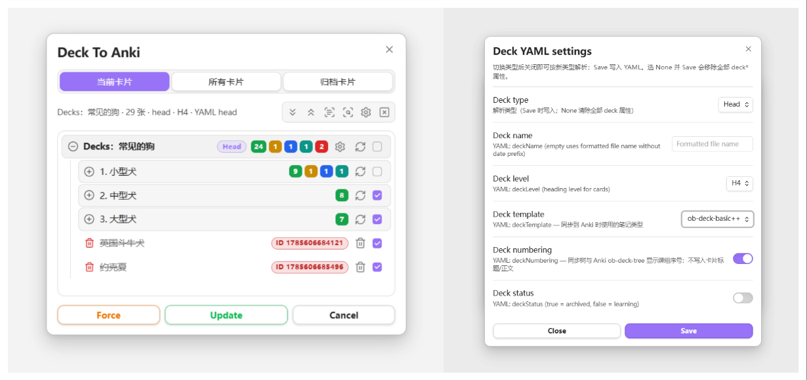
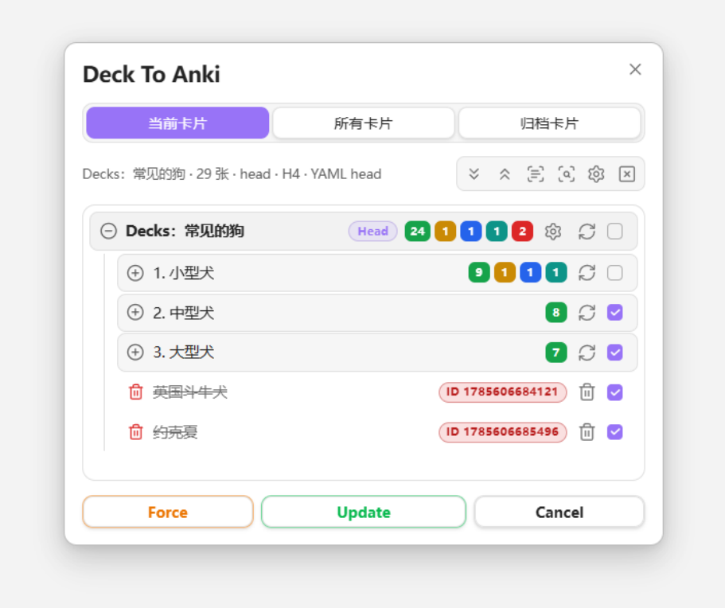
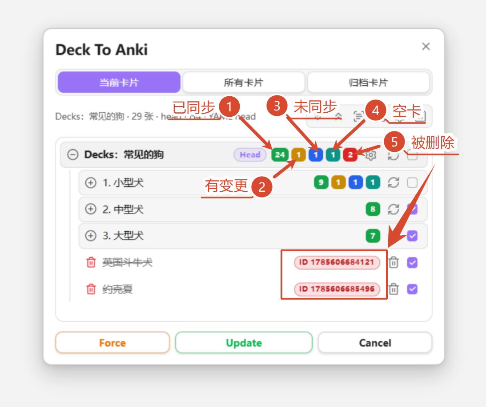
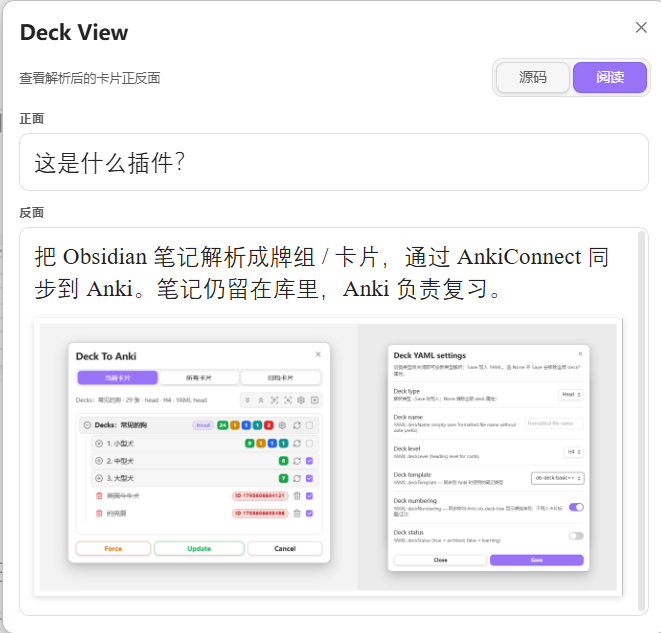
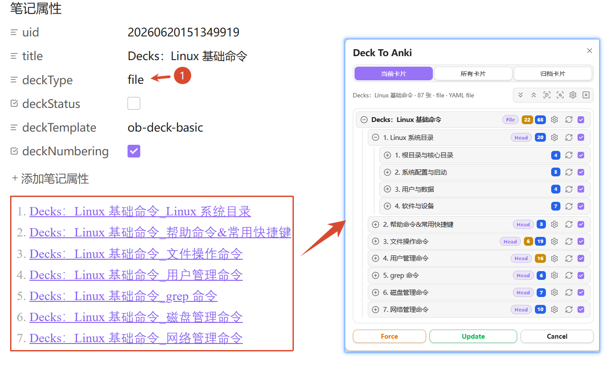
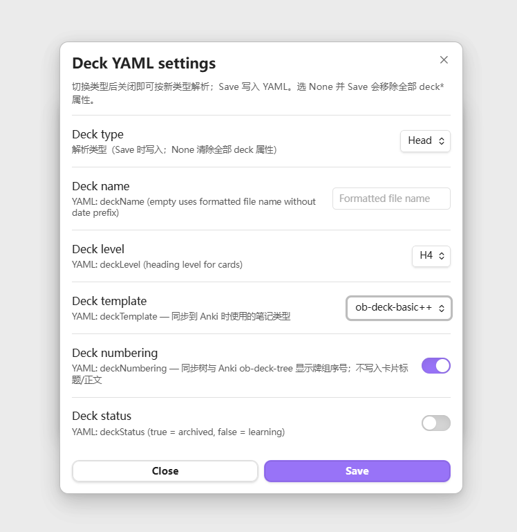
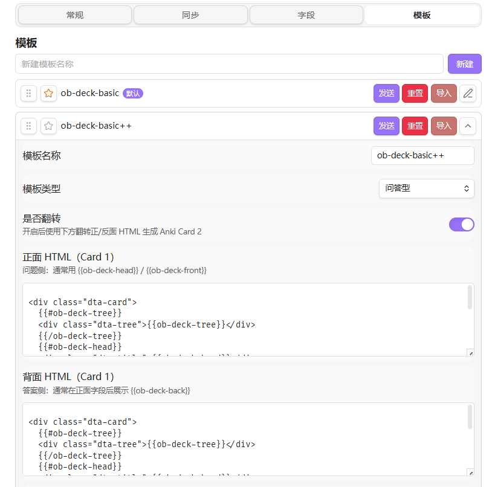
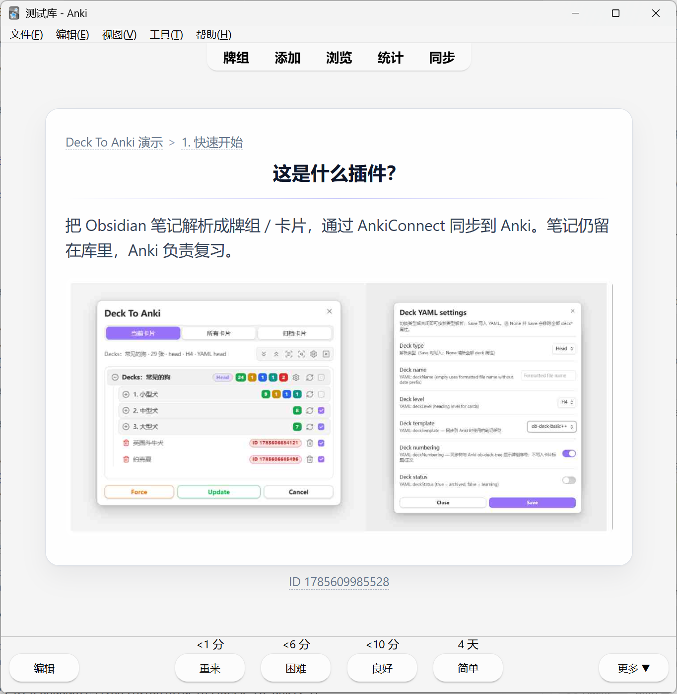
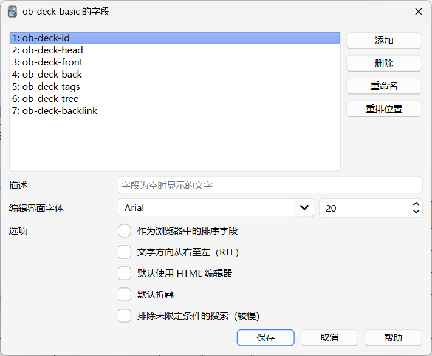

# Deck To Anki

> 中文文档：[README.zh.md](README.zh.md)

## Overview

**Deck To Anki** is an Obsidian community plugin that turns notes into Anki decks via [AnkiConnect](https://foosoft.net/projects/anki-connect/). Write cards in Obsidian (heading trees, lists, single-file cards, or filename-as-front), preview and select them in the sync panel, then push, update, or delete notes in Anki. Optional backlinks jump back to the source note, heading, or block.

### Features

- **Notes as cards** — author Q&A cards in Obsidian without a separate card editor
- **Five parse modes** — `head` / `list` / `card` / `title` / `file`
- **Reversible templates** — built-in `ob-deck-basic++` for flipped review
- **Rich content** — images, math, tables, fenced code (Prism highlighting), and tags
- **Wiki links & embeds** — `[[note]]` and `![[media]]` support
- **Backlinks** — open the source in Obsidian from Anki (ObURI / Advanced URI)
- **Image compression** — optional compress-on-sync (vault files unchanged)

Requirements: Obsidian ≥ 1.7.2, Anki + AnkiConnect.



## Quick start

### Prerequisites

1. Install and enable the **Deck To Anki** plugin
2. Install and run [Anki](https://apps.ankiweb.net/) with [AnkiConnect](https://foosoft.net/projects/anki-connect/) (default `http://127.0.0.1:8765`)

Suggested AnkiConnect config:

```json
{
    "apiKey": null,
    "apiLogPath": null,
    "ignoreOriginList": [],
    "webBindAddress": "127.0.0.1",
    "webBindPort": 8765,
    "webCorsOriginList": [
        "http://localhost",
        "app://obsidian.md"
    ]
}
```

### Open the sync panel

- Click the Anki ribbon icon, or
- Run the command **Deck To Anki**

Preview parsed cards, select what to sync, check differences against Anki, then run **Update** / **Force**. You can copy [`examples/Deck-To-Anki-演示.md`](examples/Deck-To-Anki-演示.md) into your vault for a quick trial.

## Sync panel

Open the panel from the ribbon or the **Deck To Anki** command.



- **Current cards**: parse the active note
- **All cards / Archived cards**: scan notes with `deckType` inside the configured scan scope
- Toolbar: expand/collapse, select all, check, refresh, Force, Update
- Row actions: preview, deck YAML settings, sync one card, checkbox

Check-related options live under **Settings → Sync → Check**.

### Check status colors

| Status | Color | Meaning |
| ------ | ----- | ------- |
| Synced | 🟩 green | Matches Anki |
| Modified | 🟥 red | Local differs from Anki |
| Unsynced | 🟨 yellow | Not yet pushed to Anki |
| Anki only | 🟦 blue | Present in Anki, missing locally |
| empty | 🩵 cyan | Empty back (unchecked by default after parse) |
| Unchecked | 🩶 gray | Not compared with Anki yet |



### Card preview

Use the Deck View button on a card row to preview the rendered card.



## Parse modes

| Mode | Description | Note id location |
| ---- | ----------- | ---------------- |
| **Head** (default) | Heading at the configured level is the front; body is the back. A lone `---` line can split front/back further. | `<!--ID: n-->` |
| **List** | Top-level list item is the front; indented content is the back (one indent level removed). | Trailing `^deckID` on the list line |
| **Card** | After YAML, a lone `---` splits front/back; one card per note. | YAML `deckID` |
| **Title** | Filename is the front; body after YAML is the back; one card per note. | YAML `deckID` |
| **File** | Parent note organizes child notes via wiki links; children parse as head/list/card/title. | Depends on child mode |

File mode is for chapter-style decks. Nested File mode is **not** supported (a child note cannot itself use File mode):



## Deck YAML properties

Deck settings are stored in note YAML and can be edited from the deck row settings panel:



| Field | Description |
| ----- | ----------- |
| `deckType` | `head` / `list` / `card` / `title` / `file` |
| `deckName` | Display name (optional) |
| `deckLevel` | Head: heading level used as card front (1–6) |
| `deckStatus` | `false` studying; `true` archived |
| `deckFile` | File mode: parent index note |
| `deckTemplate` | Anki note type id |
| `deckNumbering` | Whether to sync deck numbering into the tree field |
| `deckID` | Card / Title mode: Anki note id |

## Settings

- **General**: default parse mode, heading level, wiki links, Deck View, scan scope
- **Sync**: AnkiConnect URL, deck numbering, check options, image compression
- **Fields**: tags / backlink / deck-tree fields and backlink scheme
- **Templates**: built-in and custom Anki card templates (Front / Back / CSS)

### General

Under **Settings → General** (per-note YAML can override):

1. **Default deck mode** — `head` / `list` / `card` / `title` / `file` (default Head)
2. **Default heading level** — used in Head mode when `deckLevel` is absent (default H4)
3. **Parse wiki links** — convert `[[links]]` into clickable backlinks (does not affect `![[media]]`)
4. **Deck View default** — source / reading

**Scan scope** (All / Archive tabs only):

1. **Include folders** — empty = entire vault; multi-select, includes subfolders
2. **Ignore folders** — exclude from results
3. **Tag filter** — keep notes with any listed tag; `anki` also matches `anki/deck`

### Sync

Requires Anki + AnkiConnect (default `http://127.0.0.1:8765`).

1. **AnkiConnect URL**
2. **Status checks** — auto-check when opening panels / selecting cards; optionally require a check before sync
3. **Image compression** — compress uploads only; vault files stay untouched; adjustable quality and cache clear

### Templates

Defaults include `ob-deck-basic` and reversible `ob-deck-basic++`. Customize Front / Back HTML and CSS.



Default look in Anki:



### Fields

Under **Settings → Fields**:

1. **Sync tags** — write `ob-deck-tags` and sync Anki note tags
2. **Card backlink** — write `ob-deck-backlink` (Head → heading, List → block, Card → file)
3. **Deck tree** — write `ob-deck-tree`; optional clickable crumbs
4. **Backlink scheme** — `none` / `oburi` / `aduri` (Advanced URI)



| Field | Description |
| ----- | ----------- |
| ob-deck-id | Note identity field (first model field for AnkiConnect) |
| ob-deck-head | Card title / navigation heading; stored separately from front body |
| ob-deck-front | Front body |
| ob-deck-back | Back body |
| ob-deck-tags | Obsidian tags; can sync as Anki tags |
| ob-deck-tree | Deck path crumbs |
| ob-deck-backlink | Backlink to the Obsidian card (heading / block / file) |

## Commands

| Command | Action |
| ------- | ------ |
| Deck To Anki | Open the sync modal |
| Open sync sidebar | Open the sync sidebar view |
| Clear all deckIDs in current file | Remove deck IDs from the active note |
| Clear all deckIDs and deck YAML in current file | Remove deck IDs and deck YAML properties |

## Install

### BRAT

Add this repository with [BRAT](https://github.com/TfTHacker/obsidian42-brat):

```text
PandaNocturne/obsidian-deck-to-anki
```

### Manual

1. Download the latest release from [Releases](https://github.com/PandaNocturne/obsidian-deck-to-anki/releases)
2. Place `main.js`, `manifest.json`, and `styles.css` in:

```text
<Vault>/.obsidian/plugins/deck-to-anki/
```

3. Reload Obsidian and enable **Deck To Anki** under **Settings → Community plugins**

### Build from source

```bash
npm install
npm run build
```

Artifacts: `main.js`, `manifest.json`, `styles.css` at the plugin root.

## Development

```bash
npm install
npm run dev    # watch build
npm run build  # production build
npm run lint
```

Release checklist:

1. Bump `version` / `minAppVersion` in `manifest.json`
2. `npm version <new>` (updates `versions.json`)
3. `npm run build`
4. `git push origin <tag>`
5. `gh release create <tag> main.js manifest.json styles.css`

## License

See `LICENSE` in the repository.
